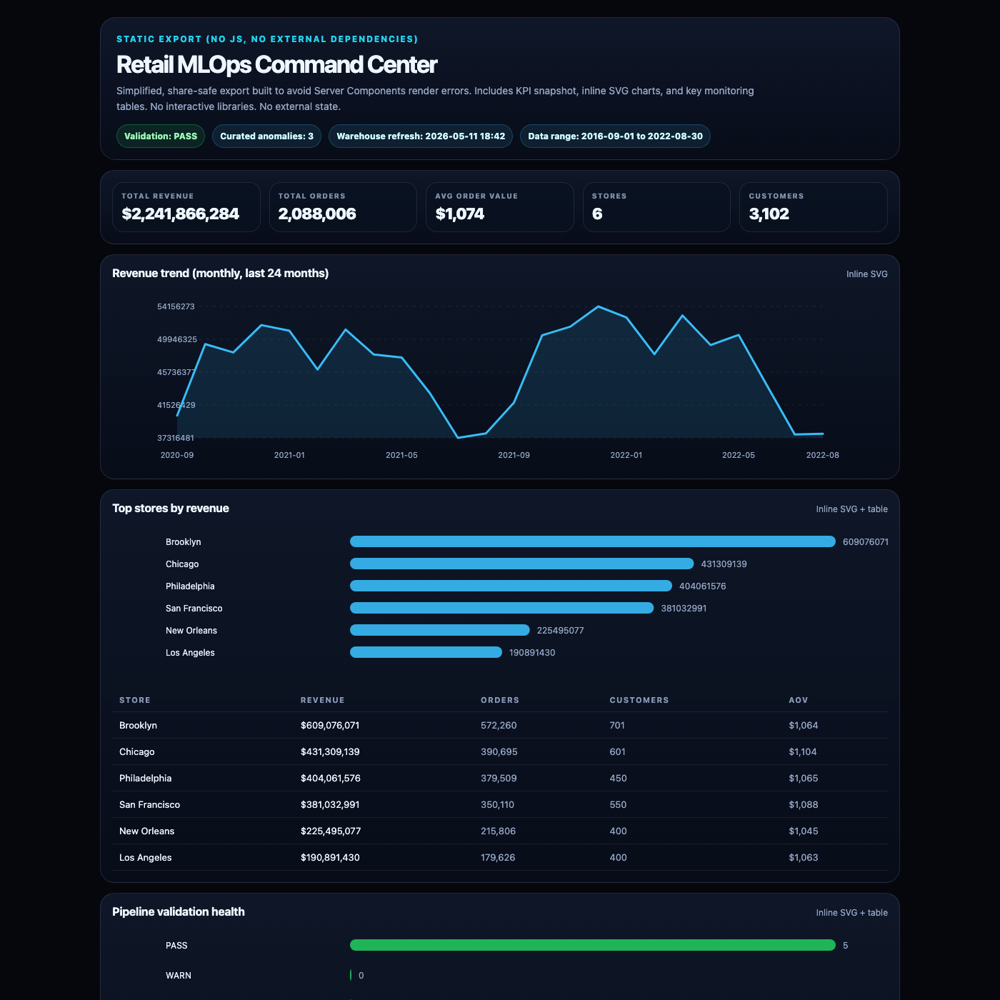

# Retail Revenue Operations Analytics & ML Monitoring Platform

<p align="center">
  <a href="https://htmlpreview.github.io/?https://github.com/ozzy2438/mlops_tutorial2/blob/main/docs/retail_mlops_dashboard_static.html" target="_blank">
    
  </a>
</p>

<p align="center">
  <a href="https://htmlpreview.github.io/?https://github.com/ozzy2438/mlops_tutorial2/blob/main/docs/retail_mlops_dashboard_static.html" target="_blank">
    
  </a>
</p>

## 1. Objective

Build a production-style retail analytics platform that turns raw order,
customer, product, store and supply data into trusted business-ready marts,
automated validation checks, anomaly detection outputs and an executive
monitoring dashboard.

## 2. Business Problem

A simulated mid-size retail operations team needed reliable visibility into
sales performance, store behaviour, product trends, data quality and abnormal
revenue or order patterns before executive reporting cycles. The original
process depended on manual SQL checks and fragmented Snowflake analysis, making
it difficult to catch data-quality issues or unusual sales behaviour early.

## 3. What This Project Solves

- Converts raw retail data into a medallion-style warehouse architecture
- Builds staging, intermediate and marts layers
- Creates star-schema business marts for customers, products, stores,
  supplies, orders and order items
- Automates Snowflake deployment using GitHub Actions
- Adds automated data-quality validation tests
- Separates hard failures from known business warnings
- Produces validation and observability reports
- Adds warehouse-native ML anomaly detection for daily revenue, order volume
  and store-level sales patterns
- Supports an interactive executive dashboard for revenue, pipeline health,
  data quality and anomaly monitoring

## 4. Key Outcomes

- Modelled 2.08M+ orders
- Modelled 3.02M+ order-item records
- Built RAW -> STAGING -> INT -> MARTS warehouse layers
- Added 16+ automated validation checks
- Added ML anomaly detection outputs
- Replaced manual Snowflake QA checks with repeatable CI/CD validation
- Produced dashboard-ready marts and monitoring outputs

## 5. Architecture Overview

```text
Azure Blob Storage
-> Snowflake RAW
-> STAGING
-> INT_LAYER
-> MARTS_LAYER
-> DATA QUALITY TESTS
-> OBSERVABILITY REPORTS
-> ML_LAYER
-> Static HTML Dashboard
```

- `RAW`: source-aligned landing tables
- `STAGING`: cleaned and standardised source tables
- `INT_LAYER`: reusable business logic and intermediate metrics
- `MARTS_LAYER`: BI-ready dimension and fact tables
- `TESTS`: automated data quality validation
- `OBSERVABILITY`: JSON and Markdown validation reports
- `ML_LAYER`: anomaly detection outputs
- `Dashboard`: executive monitoring layer

## 6. Data Model

Main entities:

- customers
- orders
- order_items
- products
- stores
- supplies

Star schema:

- `DIM_CUSTOMERS`
- `DIM_PRODUCTS`
- `DIM_STORES`
- `DIM_SUPPLIES`
- `FCT_ORDERS`
- `FCT_ORDER_ITEMS`
- `RETAIL_SALES_WIDE`

`DIM` tables describe entities. `FACT` tables describe business events.
`RETAIL_SALES_WIDE` is a dashboard convenience table, not the canonical model.

## 7. Data Quality & CI/CD

GitHub Actions deploys Snowflake SQL, then runs validation after deployment.
The pipeline fails on true data-quality failures, while known zero-value order
exceptions are treated as warnings rather than hard failures. Validation and
observability reports are uploaded as workflow artifacts.

Example validation checks:

- unique `customer_id`
- unique `order_id`
- non-null keys
- referential integrity
- no negative sales amounts
- no future order dates
- duplicate grain checks
- ML anomaly output validation

## 8. ML Anomaly Detection

The ML layer uses Snowflake-native anomaly detection over daily sales
aggregates in a simulated retail operations environment.

It covers:

- daily revenue
- daily order count
- store-level daily revenue
- anomaly results stored in `ML_LAYER`
- outputs used for monitoring and dashboard review

This is a production-style analytics engineering implementation, not a live
deployment for a real company.

## 9. Dashboard

The final dashboard is published as a static HTML export for reliable public
viewing without login, third-party session state or server-side render
dependencies.

It includes:

- executive KPIs
- sales trends
- store performance
- data-quality status
- pipeline health
- ML anomaly monitoring

## Dashboard Preview

<p align="center">
  <a href="https://htmlpreview.github.io/?https://github.com/ozzy2438/mlops_tutorial2/blob/main/docs/retail_mlops_dashboard_static.html" target="_blank">
    
  </a>
</p>

> Click the preview above to open the static dashboard export in your browser.

## 10. Tooling

- Data Warehouse: Snowflake
- Cloud Storage: Azure Blob Storage
- Transformation: SQL
- CI/CD: GitHub Actions
- Validation: Python, SQL tests
- Observability: JSON and Markdown validation artifacts
- ML: Snowflake ML anomaly detection
- Dashboard: Static HTML export
- Version Control: GitHub
- Collaboration: Pull Requests, branch-based workflow

## 11. Repository Structure

```text
snowflake/
  setup/
  staging/
  int_layer/
  marts_layer/
  ml/
  tests/
scripts/
  deploy_snowflake_sql.py
  validate_snowflake_models.py
docs/
  sprint2_snowflake_data_model_summary.md
  sprint3_cicd_snowflake_deployment.md
  sprint4_data_quality_testing.md
  sprint5_observability_reporting.md
  sprint5_snowflake_ml_anomaly_detection.md
```

## 12. How to Run

At a high level:

1. Configure GitHub Actions secrets.
2. Merge to `main` or trigger the workflow manually.
3. Deployment runs Snowflake SQL in order.
4. Validation tests run after deployment.
5. Reports are uploaded as workflow artifacts.

Required GitHub secrets:

- `SNOWFLAKE_ACCOUNT`
- `SNOWFLAKE_USER`
- `SNOWFLAKE_PASSWORD`
- `SNOWFLAKE_ROLE`
- `SNOWFLAKE_WAREHOUSE`
- `SNOWFLAKE_DATABASE`

Do not commit real secrets.

## 13. Known Limitations

- This is a simulated retail operations project
- Azure raw ingestion is excluded from automated CI/CD by default because it
  requires secure runtime credentials
- Product-supply profitability modelling is deferred until SKU-level supply
  mapping is fully modelled
- Password-based Snowflake auth is used for learning; future improvement would
  use key-pair auth or workload identity
- Static dashboard export is checked into the repo for reliable public preview

## 14. Future Improvements

- dbt conversion
- key-pair authentication
- scheduled Snowflake tasks
- improved ML monitoring
- Slack and Jira alerting
- product-supply cost modelling
- Power BI or Streamlit production dashboard

## 15. Resume Summary

Built a Snowflake-based retail analytics and ML monitoring platform for a
simulated mid-size retail operations team, modelling 2.08M+ orders and 3.02M+
order-item records into trusted marts, automated data-quality checks and
anomaly monitoring. Replaced manual Snowflake QA with GitHub Actions CI/CD
validation and delivered dashboard-ready outputs for revenue, pipeline health
and abnormal sales behaviour monitoring.
